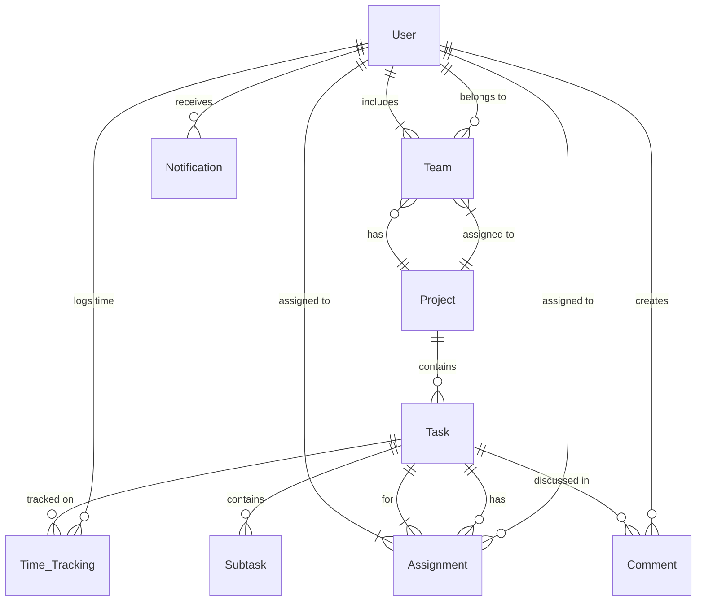

# Database Schema Implementation Design

## Overview

This design document outlines the comprehensive database schema implementation for the TaskHub project management system. The design focuses on creating 9 core entities using TypeORM with PostgreSQL, establishing proper relationships, implementing performance optimizations, and ensuring data integrity. The schema supports the complete feature set including user management, project organization, task tracking, team collaboration, time management, and notification systems.

The design leverages TypeORM's decorator-based approach for entity definition, relationship management, and migration generation. All entities follow consistent patterns with UUID primary keys, audit timestamps, and proper indexing for production-ready performance.

## Architecture

### Database Technology Stack

- **Database Engine**: PostgreSQL 14+ for robust relational data management and ACID compliance
- **ORM Framework**: TypeORM 0.3+ for entity management, relationship handling, and migration control
- **Primary Key Strategy**: UUID v4 for distributed system compatibility and security
- **Connection Management**: TypeORM connection pooling with configurable pool sizes
- **Migration Strategy**: Code-first approach with TypeORM migration generation and version control

### Entity Relationship Architecture

The database schema follows a normalized relational design with clear entity boundaries and well-defined relationships:



### Data Flow Architecture

1. **User Management Flow**: User creation → Role assignment → Team membership → Task assignments
2. **Project Lifecycle Flow**: Project creation → Team formation → Task creation → Assignment distribution
3. **Task Management Flow**: Task creation → Subtask breakdown → Assignment → Time tracking → Status updates
4. **Notification Flow**: System events → Notification generation → User delivery → Read status tracking

## Components and Interfaces

### Core Entity Components

#### 1. User Entity (`src/users/entities/user.entity.ts`)

**Purpose**: Central user management with authentication and role-based access control

**Key Features**:

- UUID primary key for security and scalability
- Bcrypt password hashing with configurable rounds
- Role-based enumeration (admin, manager, member)
- Email uniqueness constraint
- Audit timestamps for user activity tracking

**Relationships**:

- One-to-Many with Team (user can belong to multiple teams)
- One-to-Many with Assignment (user can have multiple task assignments)
- One-to-Many with Time_Tracking (user can log time on multiple tasks)
- One-to-Many with Comment (user can create multiple comments)
- One-to-Many with Notification (user can receive multiple notifications)

#### 2. Project Entity (`src/projects/entities/project.entity.ts`)

**Purpose**: Project container for organizing teams and tasks with lifecycle management

**Key Features**:

- UUID primary key for distributed system compatibility
- Status enumeration (active, completed, on_hold)
- Date validation ensuring logical start/end date relationships
- Soft delete capability for data preservation
- Project metadata including name, description, and timeline

**Relationships**:

- One-to-Many with Team (project can have multiple teams)
- One-to-Many with Task (project contains multiple tasks)

#### 3. Task Entity (`src/tasks/entities/task.entity.ts`)

**Purpose**: Core task management with priority, status, and resource tracking

**Key Features**:

- UUID primary key for task identification
- Status enumeration (todo, in_progress, done)
- Priority enumeration (low, medium, high, critical)
- Manday estimation and consumption tracking
- Deadline management with date validation
- Rich task description and metadata

**Relationships**:

- Many-to-One with Project (task belongs to one project)
- One-to-Many with Assignment (task can have multiple assignees)
- One-to-Many with Subtask (task can have multiple subtasks)
- One-to-Many with Time_Tracking (task can have multiple time entries)
- One-to-Many with Comment (task can have multiple comments)

#### 4. Team Entity (`src/teams/entities/team.entity.ts`)

**Purpose**: Team organization and project-user relationship management

**Key Features**:

- UUID primary key for team identification
- Project association for team scope
- Team metadata including name and description
- Member management through user relationships

**Relationships**:

- Many-to-One with Project (team belongs to one project)
- Many-to-Many with User (team has multiple users, users can be in multiple teams)

#### 5. Assignment Entity (`src/assignments/entities/assignment.entity.ts`)

**Purpose**: Junction table managing task-user relationships with role specifications

**Key Features**:

- UUID primary key for assignment tracking
- Role enumeration for assignment responsibility
- Assignment date tracking
- Status tracking for assignment lifecycle

**Relationships**:

- Many-to-One with Task (assignment belongs to one task)
- Many-to-One with User (assignment belongs to one user)

### Supporting Entity Components

#### 6. Subtask Entity (`src/subtasks/entities/subtask.entity.ts`)

**Purpose**: Hierarchical task breakdown for detailed project planning

**Key Features**:

- UUID primary key for subtask identification
- Self-referencing parent task relationship
- Independent status tracking
- Circular reference prevention
- Cascade delete behavior

**Relationships**:

- Many-to-One with Task (subtask belongs to parent task)

#### 7. Time_Tracking Entity (`src/time-tracking/entities/time-tracking.entity.ts`)

**Purpose**: Actual time logging for manday calculation and effort tracking

**Key Features**:

- UUID primary key for time entry identification
- Hours worked validation (positive values only)
- Work date validation and tracking
- Detailed notes for time entry context
- Manday calculation support

**Relationships**:

- Many-to-One with Task (time entry belongs to one task)
- Many-to-One with User (time entry belongs to one user)

#### 8. Notification Entity (`src/notifications/entities/notification.entity.ts`)

**Purpose**: System notification management for alerts and status updates

**Key Features**:

- UUID primary key for notification identification
- Notification type enumeration (deadline, assignment, status)
- Read/unread status tracking
- Message content and metadata
- Bulk operation support

**Relationships**:

- Many-to-One with User (notification belongs to one user)

#### 9. Comment Entity (`src/comments/entities/comment.entity.ts`)

**Purpose**: Task-specific collaboration and discussion management

**Key Features**:

- UUID primary key for comment identification
- Rich text content support
- Edit tracking and history
- Soft delete for history preservation
- Chronological ordering support

**Relationships**:

- Many-to-One with Task (comment belongs to one task)
- Many-to-One with User (comment created by one user)

## Data Models

### Entity Definitions with TypeORM Decorators

#### User Entity Structure

```typescript
@Entity('users')
export class User {
  @PrimaryGeneratedColumn('uuid')
  id: string;

  @Column({ unique: true })
  email: string;

  @Column()
  password: string;

  @Column({ type: 'enum', enum: UserRole, default: UserRole.MEMBER })
  role: UserRole;

  @Column({ nullable: true })
  firstName?: string;

  @Column({ nullable: true })
  lastName?: string;

  @CreateDateColumn()
  createdAt: Date;

  @UpdateDateColumn()
  updatedAt: Date;

  // Relationships
  @OneToMany(() => Assignment, (assignment) => assignment.user)
  assignments: Assignment[];

  @OneToMany(() => TimeTracking, (timeTracking) => timeTracking.user)
  timeEntries: TimeTracking[];

  @OneToMany(() => Comment, (comment) => comment.user)
  comments: Comment[];

  @OneToMany(() => Notification, (notification) => notification.user)
  notifications: Notification[];

  @ManyToMany(() => Team, (team) => team.members)
  teams: Team[];
}
```

#### Task Entity Structure

```typescript
@Entity('tasks')
export class Task {
  @PrimaryGeneratedColumn('uuid')
  id: string;

  @Column()
  title: string;

  @Column({ type: 'text', nullable: true })
  description?: string;

  @Column({ type: 'enum', enum: TaskStatus, default: TaskStatus.TODO })
  status: TaskStatus;

  @Column({ type: 'enum', enum: TaskPriority, default: TaskPriority.MEDIUM })
  priority: TaskPriority;

  @Column({ type: 'timestamp', nullable: true })
  deadline?: Date;

  @Column({ type: 'decimal', precision: 5, scale: 2, default: 0 })
  estimatedMandays: number;

  @Column({ type: 'decimal', precision: 5, scale: 2, default: 0 })
  consumedMandays: number;

  @CreateDateColumn()
  createdAt: Date;

  @UpdateDateColumn()
  updatedAt: Date;

  // Relationships
  @ManyToOne(() => Project, (project) => project.tasks)
  @JoinColumn({ name: 'project_id' })
  project: Project;

  @OneToMany(() => Assignment, (assignment) => assignment.task)
  assignments: Assignment[];

  @OneToMany(() => Subtask, (subtask) => subtask.parentTask)
  subtasks: Subtask[];

  @OneToMany(() => TimeTracking, (timeTracking) => timeTracking.task)
  timeEntries: TimeTracking[];

  @OneToMany(() => Comment, (comment) => comment.task)
  comments: Comment[];
}
```

### Enumeration Definitions

#### User Role Enumeration

```typescript
export enum UserRole {
  ADMIN = 'admin',
  MANAGER = 'manager',
  MEMBER = 'member',
}
```

#### Task Status Enumeration

```typescript
export enum TaskStatus {
  TODO = 'todo',
  IN_PROGRESS = 'in_progress',
  DONE = 'done',
}
```

#### Task Priority Enumeration

```typescript
export enum TaskPriority {
  LOW = 'low',
  MEDIUM = 'medium',
  HIGH = 'high',
  CRITICAL = 'critical',
}
```

#### Project Status Enumeration

```typescript
export enum ProjectStatus {
  ACTIVE = 'active',
  COMPLETED = 'completed',
  ON_HOLD = 'on_hold',
}
```

### Database Indexing Strategy

#### Performance-Critical Indexes

```typescript
// User entity indexes
@Index(['email']) // Unique constraint and login queries
@Index(['role']) // Role-based queries

// Task entity indexes
@Index(['status']) // Status filtering
@Index(['priority']) // Priority filtering
@Index(['deadline']) // Deadline queries and sorting
@Index(['project_id']) // Project-task relationships

// Project entity indexes
@Index(['status']) // Project status filtering
@Index(['createdAt']) // Chronological sorting

// Assignment entity indexes
@Index(['task_id', 'user_id']) // Composite index for assignments
@Index(['user_id']) // User assignment queries

// Time tracking indexes
@Index(['task_id']) // Task time entries
@Index(['user_id']) // User time entries
@Index(['workDate']) // Date-based queries

// Notification indexes
@Index(['user_id', 'isRead']) // Unread notifications
@Index(['createdAt']) // Chronological ordering
```

## Error Handling

### Database Connection Error Handling

**Connection Pool Management**:

- Implement connection pool monitoring with health checks
- Configure automatic reconnection with exponential backoff
- Set appropriate connection timeouts and retry limits
- Log connection pool metrics for monitoring

**Transaction Error Handling**:

- Implement transaction rollback on constraint violations
- Handle deadlock detection and retry mechanisms
- Provide meaningful error messages for constraint failures
- Log transaction failures with context information

### Entity Validation Error Handling

**Data Validation**:

- Use class-validator decorators for input validation
- Implement custom validators for business logic constraints
- Provide detailed validation error messages
- Handle validation errors at the service layer

**Relationship Integrity**:

- Implement foreign key constraint error handling
- Provide cascade delete protection for critical relationships
- Handle orphaned record cleanup
- Validate relationship constraints before operations

### Migration Error Handling

**Schema Migration Safety**:

- Implement migration rollback procedures
- Validate migration scripts before execution
- Handle migration conflicts in team environments
- Backup database before major schema changes

## Testing Strategy

### Unit Testing Approach

**Entity Testing**:

- Test entity creation with valid and invalid data
- Validate relationship mappings and constraints
- Test enumeration value assignments
- Verify audit timestamp functionality

**Repository Testing**:

- Mock TypeORM repository methods
- Test CRUD operations with various scenarios
- Validate query builder functionality
- Test transaction handling and rollback

### Integration Testing Approach

**Database Integration**:

- Use test database with Docker containers
- Test entity relationships and cascading operations
- Validate foreign key constraints
- Test migration execution and rollback

**Performance Testing**:

- Test query performance with large datasets
- Validate index effectiveness
- Test connection pool behavior under load
- Monitor memory usage during bulk operations

### Test Data Management

**Test Fixtures**:

- Create entity factories for test data generation
- Implement database seeding for integration tests
- Use transaction rollback for test isolation
- Provide realistic test data scenarios

**Test Database Configuration**:

- Separate test database configuration
- Automated test database setup and teardown
- Test data cleanup between test runs
- Database state verification utilities

## Migration Strategy

### TypeORM Migration Workflow

**Migration Generation**:

```bash
# Generate migration from entity changes
npm run migration:generate -- --name CreateInitialSchema

# Create empty migration file
npm run migration:create -- --name AddIndexesToTasks

# Run migrations
npm run migration:run

# Revert last migration
npm run migration:revert
```

**Migration File Structure**:

- Descriptive migration names with timestamps
- Both up() and down() methods for reversibility
- Index creation in separate migrations
- Data migrations separate from schema migrations

### Deployment Migration Strategy

**Production Migration Process**:

1. Backup database before migration execution
2. Run migrations in maintenance window
3. Verify migration success with health checks
4. Rollback procedure if migration fails
5. Post-migration validation and monitoring

**Development Migration Workflow**:

- Generate migrations from entity changes
- Review migration files before committing
- Test migrations on development database
- Coordinate migrations across team members

## Performance Considerations

### Query Optimization

**Index Strategy**:

- Composite indexes for multi-column queries
- Partial indexes for filtered queries
- Covering indexes for read-heavy operations
- Regular index usage analysis and optimization

**Query Patterns**:

- Use TypeORM query builder for complex queries
- Implement pagination for large result sets
- Optimize N+1 query problems with eager loading
- Use database views for complex aggregations

### Connection Pool Optimization

**Pool Configuration**:

```typescript
extra: {
  max: 20, // Maximum connections in pool
  min: 5,  // Minimum connections in pool
  idleTimeoutMillis: 30000, // Close idle connections
  connectionTimeoutMillis: 2000, // Connection timeout
  acquireTimeoutMillis: 60000, // Acquire timeout
}
```

**Monitoring and Alerting**:

- Track connection pool utilization
- Monitor query execution times
- Alert on connection pool exhaustion
- Log slow queries for optimization

This design provides a comprehensive foundation for the TaskHub database schema implementation, ensuring scalability, performance, and maintainability while supporting all required business functionality.
